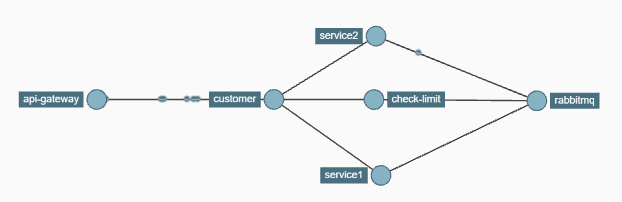

# checking-counter-app

Приложение на основе микросервисной архитектуры. Основная задача приложения - проверка доступности заданного лимита на использование абстрактного сервиса с использованием RabbitMQ.

Customer – точка входа в программу, регистрация пользователей, проверка лимита, получение сервисов. Общение с другими микросервисами через FeignClient. Сохранение в Postgres зарегистрированных уникальных по email пользователей.
Service1, Service2 – эмулируют предоставление контента, направляют информацию в Check‑Limit (используя очередь RabbitMQ) об обратившемся пользователе, времени обращения, наименовании и стоимости сервиса.
Check‑Limit получает из очереди сообщение и сохраняет данные в PostgreSQL. Проверяет перед обращением в Service1 и Service2 лимит использования сервисов. Не допускает получение сервиса в случае превышения или возможного превышения лимита. В расчете лимита участвуют записи за последние 10 секунд.

This application is based on microservice architecture. The main task of the application is to check the availability of a given limit on the use of an abstract service using RabbitMQ. 

Customer is the entry point to the program, user registration, limit checking, receiving services. Microservices communicate with other microservices through FeignClient. Registered unique email users are stored in Postgre. 
Service1, Service2 - play the role of emulating the provision of content and send information to Check-Limit (using the RabbitMQ queue) about the user who applied, the time of access, the name and cost of the service. 
Check-Limit receives a message from the queue and stores the data in PostgreSQL. Checks the service usage limit before contacting Service1 and Service2. Does not allow receiving the service in case of exceeding or possible exceeding the limit. Records for the last 10 seconds are included in the calculation of the limit.
